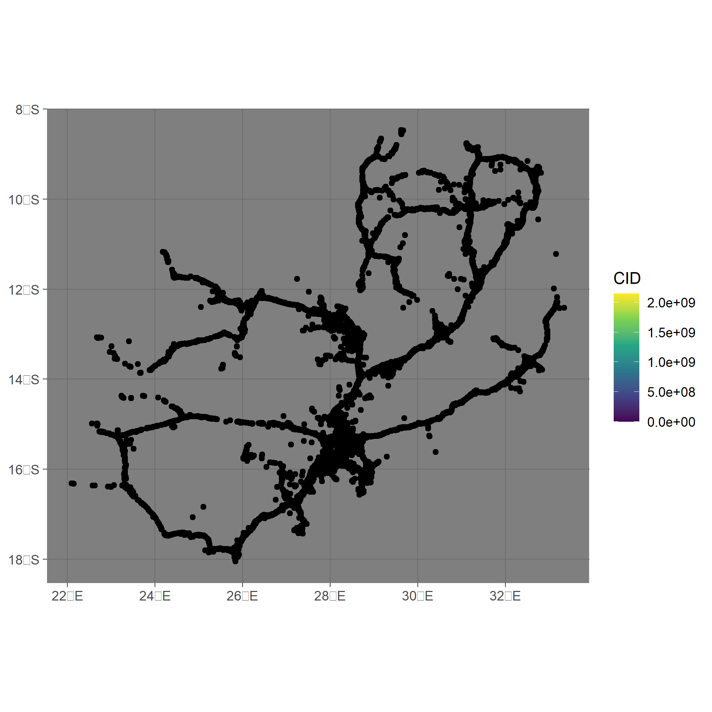

```{css, echo=FALSE}
body {
  font-size: 14px;
}
```

```{r setp, include=FALSE}
knitr::opts_chunk$set(echo = FALSE, warning = FALSE, message = FALSE, fig.align = "center")
knitr::opts_chunk$set(fig.width = 7, fig.height = 5, fig.align = 'center', fig.show='asis')
```

```{r sp, include=FALSE}
library(RColorBrewer)
library(viridisLite)
library(stringr)
library(knitr)
library(readr)
library(sf)
library(readr)
library(ggthemes)
library(dplyr)
library(ggplot2)
library(kableExtra)
```
## Executive summary

Zambia has been characterized by an increased internet access across the early '00s as shown by the graph, taken from Statista using elaborations from the International Telecommunication Union (ITU) reported below:

::: {align="center"}
{width="600" height="500"}
:::
-   As it is visible from the histogram around 2016 there has been a **significant increase in the internet acce**ss preceded by a steady increasing trend across all the previous years, and the literature reports this spike to be related mainly to a more diffused access to mobile internet. At the same time Zambia has hold two main elections in the period around the increase in the mobile connection bandwidth: one in 2011 and one in 2016.

-   Therefore, the aim of this project is to assess how the possibility to connect to the internet might affect socio-economic structures of political governance through channels such as: a change in social cohesion, an effect on democratic participation and open competition or also a change in the political game that reshuffle power dynamics across parties thanks to a change in instrument for political communication.

Many are the potential channels through which internet connection could affect outcomes related to political governance and more broadly the relationship of citizens with the state.

-   The specific goal of the report is to **assess whether heterogeneity in mobile access connection is correlated with the presence of different levels of voters turnout, that is proxying electoral participation, or with different levels of valid votes, proxying a better understanding of the democratic competition rules**.

Three main datasets are used:

Firstly from the open election archives the shape of the electoral district of Zambia is taken and putted together with data coming from the OpenCellID website with an API to obtain the allocation of mobile phone towers to the electoral districts.

Then always from the open election archives electoral district level data on the electoral outcomes of the 2016 lower chamber election are employed.

The the two following figures is visible how both voters turnout and the number of mobile cells towers have a different geographical distribution across districts:

### Geographical Distribution of the voters' turnout

::: {align="center"}
{width="600" height="500"}
:::

### Geographical Distribution of internet mobile cells

::: {align="center"}
{width="600" height="500"}
:::

The research project finds that there is **little to no correlation between both the electoral participation, the number of eligible votes and the internet access** as visible in the correlation plot below.

This could be happening because there is a lot of **measurement error** in the mobile access given that the data are taken from an open source system where users voluntarily register the presence of internet cells.

Or alternatively it could e because there is already a minimum level of internet everywhere by 2016 and therefore it is no more so crucial for electoral outcomes.

::: {align="center"}
{width="600" height="500"}
:::

The project also explores the patterns of partisan vote across geographical units, finding a different geographical division for the votes to the two main parties with NRP taking the majority of its votes from the North-East and MMP winning across the South West.

# Introduction:

The project employees 3 dataset with the aim to combine geo-referenced election outcomes at electoral district level in Zambia with OpenCellID data coming from a public access API containing information on the presence of active internet cells and their coverage.

Firstly, I upload the data containing the geo-referenced information on internet access downloaded from : <https://opencellid.org/downloads.php> and I rename the columns so that it is understandable which values is what and I keep only interesting columns , to obtain the data as below as save them in a csv.

```{r upload, echo=FALSE, message=FALSE}
knitr::opts_chunk$set(echo = FALSE)
Zambia_data <- read_csv("645.csv.gz")
names(Zambia_data)[names(Zambia_data) == "645"] <- "MCC"
names(Zambia_data)[names(Zambia_data) == "GSM"] <- "Radio_type"
names(Zambia_data)[names(Zambia_data) == "3"] <- "MNC"
names(Zambia_data)[names(Zambia_data) == "3282"] <- "CID"
names(Zambia_data)[names(Zambia_data) == "130"] <- "Location_Area_Code"
names(Zambia_data)[names(Zambia_data) == "28.070755004883"] <- "lat"
names(Zambia_data)[names(Zambia_data) == "-14.902267456055"] <- "lon"
names(Zambia_data)[names(Zambia_data) == "1000"] <- "Range"
names(Zambia_data)[names(Zambia_data) == "1...10"] <- "Changeable=1"
names(Zambia_data)[names(Zambia_data) == "1...11"] <- "Changeable=0"
names(Zambia_data)[names(Zambia_data) == "1459743588...12"] <- "Created"
names(Zambia_data)[names(Zambia_data) == "1459743588...13"] <- "Updated"
Zambia_data <- Zambia_data |> 
  select(c("CID","Location_Area_Code","lat","lon","Range","Created"))
Zambia_data <- na.omit(Zambia_data)

```
 
## Mobile access in Zambia raw data


```{r uploadr, echo=FALSE, message=FALSE}
knitr::kable(head(Zambia_data), format = "markdown", booktabs = TRUE)
```

Then I transform the data from csv to a shape file creating a variable called geometry containing the information now stored in the variables latitude and longitude.

I keep only variables for which there are no missing data for longitude and latitude, otherwise I do not know where to place them in the map and I assign a coordinate reference system so that I can compare this map with the map that I will use later containing the data on the elections, to obtain the shape file of the mobile data as below:

The data on mobile access are now in shape-file format and look like this :

::: {align="center"}
{height="500" width="600px"}
:::

Here we can already see the shape of Zambia even if the borders are not clear, we see how the different variables in the dataset are distributed across the coordinates of Zambia. For now this is not particularly indicative of anything, beside that the internet access data have been successfully converted into a shape-file.

Now to give Zambia a shape and to upload the remaining part of the data necessary for the analysis I open from <https://electiondataarchive.org/data-and-documentation/georeferenced-electoral-districts-datasets/> the shapes of the Zambian electoral districts, I assign the same coordinate reference system that I assigned to the mobile data above and I obtain the data as below:

```{r newshape, echo=FALSE, message = FALSE}
gred_shp <- st_read("gred.shp")
st_crs(gred_shp) <- 4326
gred_shp <- na.omit(gred_shp)

```
## Shape of electoral districts in Zambia

```{r newshaper, echo=FALSE, message = FALSE}
knitr::kable(head(gred_shp), format = "markdown", booktabs = TRUE)

```

Plotting the data we can see how they report the coordinates of each electoral district in Zambia:

::: {align="center"}
{height="500" width="600"}
:::

## Data exploration

Now that I have both the mobile phone information and the shape of the electoral districts I can start exploring the variables of interest to answer to my research questions:

#### 1) Which is the effect of internet access, measured as the presence of an active registered CID in the electoral district, on electoral outcome, partisan vote and number of valid votes?

#### 2) How the results change when the presence of internet access is measured using the fact that there is at least one cell in the district ?

I start by looking at how the presence of internet cells are distributed in the geography looking at all the data available regardless of the year:

#### Presence of Internet Cells


::: {align="center"}
{width="600" height="500"}
:::


It is visible how considering all the years at the same time there are CID bringing internet all across the country.

Now to consider only data for the years of interest for the elections I slice the dataset into years using the column called created.

To do so I first convert the timestamp into a date, it is a Unix timestamp so it is indicating the number of seconds from a fixed date and is unreadable as it is.

The I create a list of years and I loop through it to create one dataset for each year. I'm interested in years 2011 and 2016 that can be seen below:

## 2011

```{r anotheryear, echo=FALSE, message=FALSE}
mobile_2011 <- read_csv("zambia_mobile_2011.csv")
mobile_2011 <- na.omit(mobile_2011)
```

## Mobile access in 2011

```{r anotheryearr, echo=FALSE, message=FALSE}
knitr::kable(head(mobile_2011), format = "markdown", booktabs = TRUE)

```

## 2016

```{r year, echo=FALSE, message=FALSE}
mobile_2016 <- read_csv("zambia_mobile_2016.csv")
mobile_2016 <- na.omit(mobile_2016)
```


## Mobile access in 2016

```{r yearr, echo=FALSE, message=FALSE}
knitr::kable(head(mobile_2016), format = "latex", booktabs = TRUE)
```

As it is visible the data for 2011 contain only 2 observations so the rest of the analysis will be focused on the 2016 elections.

I now open the mobile data for 2016 as a sf object (a way to call the shape files when openend with specific libraries in R) and I assign again always the same coordinate reference system.

Then I check and compare the coordinate reference system and make sure they match.

At this point I can merge the file with the shape of the electoral districts with the one of the mobile access in the year of interest for which the data are available and then write the merged dataset into a shapefile, so that I can see how many cells were in each district.

And the data look as below:

```{r merge, echo=FALSE, message=FALSE}
mobile_2016_shp <- st_read("y2016.shp")
mobile_2016_transformed <- st_transform(mobile_2016_shp, st_crs(gred_shp))
joined_sf <- st_join(gred_shp, mobile_2016_transformed, join = st_intersects)
joined_sf <- na.omit(joined_sf)
```


###Election data into districts' shapes

```{r merger, echo=FALSE, message=FALSE}
knitr::kable(head(joined_sf), format = "markdown", booktabs = TRUE)
```

::: {align="center"}
{width="600" height="500"}
:::

Now I can rename variables knowing that :

CID = number of mobile cells

Geometry = location

Range = range of functioning of the tower

## Statistical Analysis

### First treatment assignation

I can now start to see how the number of a CID mobile internet cells is correlated with district level electoral outcomes from the lower chamber election in 2016. To do this I start by creating a new variables that is corresponding to the amount of internet mobile cells present in the electoral district, this is going to be the non-experimental treatment that I will try to leverage on in the analysis. After creating the new variable I plot it's geographical distribution using a white patch for variables with no data (NA):

::: {align="center"}
{width="600" height="500"}
:::

Looking at the map above the lighter is the color the higher is the number of mobile cells and the picture suggests that there is heterogeneity in the intensity of the internet across different electoral districts.

At this point I can upload the data on the election for Zambia in 2016 taking them from <https://electiondataarchive.org/data-and-documentation/clea-lower-chamber-elections-archive/> to see how it correlates with this first treatment assignation.

The data on the elections need to be cleaned, so I keep only useful column and then rename them to obtain the dataset below:

```{r clean, echo=FALSE, message=FALSE}
Zambia_election_2016 <- read.csv("Zambia_election_2016.csv")
election_2016 <- Zambia_election_2016 |>
  select(c("cst_n", "pty_n", "pty", "pev1", "vv1", "to1", "cvs1", "pv1", "pvs1", "vot1", "ivv1"))
names(election_2016)[names(election_2016) == "cst_n"] <- "elec_district_name"
names(election_2016)[names(election_2016) == "to1"] <- "voter_turn"
names(election_2016)[names(election_2016) == "pty_n"] <- "party_name"
names(election_2016)[names(election_2016) == "pty"] <- "party_code"
names(election_2016)[names(election_2016) == "pev1"] <- "n_eligible_voters"
names(election_2016)[names(election_2016) == "pv1"] <- "n_votes"
names(election_2016)[names(election_2016) == "pvs1"] <- "party_vpte_share"
names(election_2016)[names(election_2016) == "vv1"] <- "n_valid_votes"
names(election_2016)[names(election_2016) == "ivv1"] <- "n_invalid_votes"
names(election_2016)[names(election_2016) == "vot1"] <- "vote_cast"
election_2016 <- na.omit(election_2016)

```


### Lower Chamber 2016 election data

```{r cleanr, echo=FALSE, message=FALSE}
knitr::kable(head(election_2016), format = "markdown", booktabs = TRUE)
```

The aim at this stage is to merge also election data with the previous mobile_district dataset, to do so I first rewrite the name of the districts in a way that can match the one of the previous dataset and the I join them, obtaining the data below.

```{r join, echo=FALSE, message=FALSE}
names(joined_sf)[names(joined_sf) == "cst_n"] <- "elec_district_name"
names(joined_sf)[names(joined_sf) == "cst"] <- "elec_district_code"
names(joined_sf)[names(joined_sf) == "Created"] <- "date"
mobile_district <- joined_sf |> 
  select(c('elec_district_name', 'geometry', 'elec_district_code', 'Range', 'CID', 'Rad_typ', 'date'))
mobile_district <- mobile_district |>
  group_by(elec_district_name) |>
  mutate(treat1 = n_distinct(CID))
internet_election <- left_join( mobile_district, election_2016, by = "elec_district_name")
internet_election <- na.omit(internet_election)
```

### Merged data with electoral outcomes and mobile data
```{r joinr, echo=FALSE, message=FALSE}
knitr::kable(head(internet_election), format = "markdown", booktabs = TRUE)
```

It is now possible to look at the distributions of the two outcome variables which are :

### (I) Voters Turnout

::: {align="center"}
{width="600" height="500"}
:::


It is already visible how the part of the country with a lower electoral participation in in the center of the country, and remember that white districts are those for which we have missing data.

### (II) Number of votes by party

To visualize this second outcome variable I first look at how the votes shares are distributed in all the country and then I detail district by district for the most important parties. Firstly we can see below a histogram with the vote share by party by creating a dataset with only party name and vote share and then plot it:

::: {align="center"}
{width="600" height="500"}
:::


</div>

The two main parties seem to be National Restoration Party and Movement for Multi-Party Democracy.

Looking at how the votes for the two main parties are geographically distributed :

::: {align="center"}
{width="600" height="500"}
:::

NRP is receiving more votes in the north-east part of the country while MPD is getting more support in the center where we could observe above the turnout is higher and there is relatively more internet access

::: {align="center"}
{width="600" height="500"}
:::

Now I run the correlation between having at least one CID in your district and the voters turnout using a maximum likelihood estimator and I plot it filtering out NA:

### Correlation between internet access and voters' turnout

::: {align="center"}
{width="500" height="300"}
:::

It looks like there is no correlation between the intensity of the treatment, internet access, and the voters turnout.

Now let's look at the correlation with the number of valid votes, maybe internet connection comes with more awareness on electoral competition rules:

### Correlation between internet access and number of valid votes

::: {align="center"}
{width="500" height="300"}
:::

The picture here looks very similar, little to no correlation is shown.

### Second Treatment Assignment

I can now assign the presence of internet access using the presence of treatment instead of the intensity of the treatment and see if the lack fo correlation is robust to this alternative treatment specification. To do this I create a dummy that is 1 if there is at least 1 CID in the electoral district and 0 otherwise adn then I plot it's distribution to see if there is heterogeneity in how this new way of assigning treatment look like.

::: {align="center"}
{width="600" height="500"}
:::

It is visible how in each district by 2016 there is still at least one mobile tower registered, so this way of assigning treatment is not useful for the purpose of the analysis.

To see how the intensity is changing I choose 3 different thesholds to try to identify the areas where there are more mobile cells registered. 

So I  start by creating a treatment 2.1 where I assign to this new dummy the value of 1 if in the electoral district there are at least 10 mobile cells and then I create a treatment 2.2 with having at least 25 mobile cells in the district and at the end a treatment 2.3 for having more at least 50 cells. 


## Districts having at least 10 mobile cells

::: {align="center"}
{width="500" height="600"}
:::

It is visible from the lowest threshold how the internet connection cells, as well as the most densly populated areas are located at the center of the country.


## Districts having at least 25 mobile cells

::: {align="center"}
{width="500" height="600"}
:::

When going over 25 only a bit more than the 30% of the country is colored and it is all located in nearby areas, indicating a spillover effect of the internet access most likely linked to the benefit of scale economy in technological infrastructures.


## Districts having at least 50 mobile cells


::: {align="center"}
{width="500" height="600"}
:::

After 50 cells the center is n more colored and around 10 districts located in the west-center of the country are remaining, indicating a correlation with other characteristics missing in the analysis regarding the socio-economic features of the districts' population but also that in 2016 the internet access was still not evenly distributed across different geographical areas.

# Conclusion

In conclusion there is a lot of heterogeneity in terms of geographical location for both the turnout, the party vote share, the number od eligible votes and the presence of internet access mobile towers, but the patterns do not seem to be correlated after this first exploration.

# Explained chunk of code

I choose to explain in detail this chunk of code :

```{r lewtreat, eval=FALSE, message=FALSE, warning=FALSE, echo =TRUE}
vote_share <- election_2016 |>
  group_by(party_name) |>
  summarize(total_votes = sum(n_votes, na.rm = TRUE))
party_colors <- c("#E69F00", "#56B4E9", "#009E73", "#F0E442",
                           "#0072B2", "#D55E00", "#CC79A7",
                           "#999999", "#E6007E", "#980000",
                           "#000080", "#E9A3C9", "#A9D18E", 
                           "#FFC8A3")
ggplot(vote_share, aes(x = party_name, y = total_votes, fill = party_name)) + 
  geom_bar(stat = "identity") +
  labs(title = " Number of Votes by Party", x = "Party", y = "Number of votes") +
  scale_fill_identity(guide = "legend", labels = vote_share$party_name) +
  theme_dark() +
  theme(axis.text.x = element_blank())
```

### 1

I create a subset of the election 2016 data where I have the sum of the number of votes by party, to do this i group the n_votes based on the party name using the election_2016 data and I aggregate by summing up the n_votes.

### 2

I create a list of colors, one for each party that I have in the election data generating manually color scale.

### 3

I use ggplot setting the filtered votes by party as data, explaining in the aesthetic that I want the x axis to be filled with the party names, the y axis with how many votes and the fill should be based on the color scale i created manually above.

### 4

The stat = "identity" argument tells ggplot that the y variable is already in the correct scale and should be used as it is.

### 5

I use scale_fill_identity to produce a legend with the name of the party and the assigned color at the side of the graph.

### 6

Lastly I set the theme to be dark because I like the style and I set off the names of the parties in the x axis that was too crowded.
